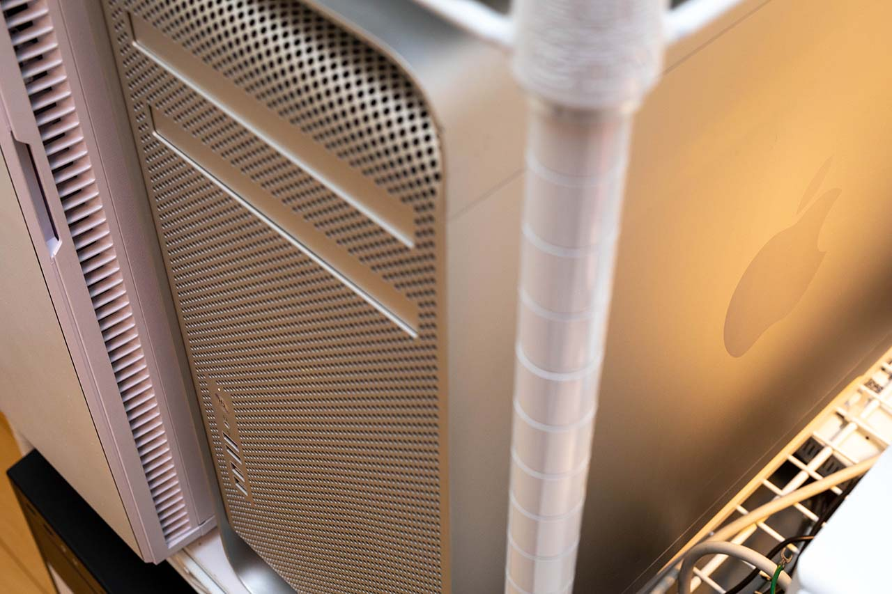
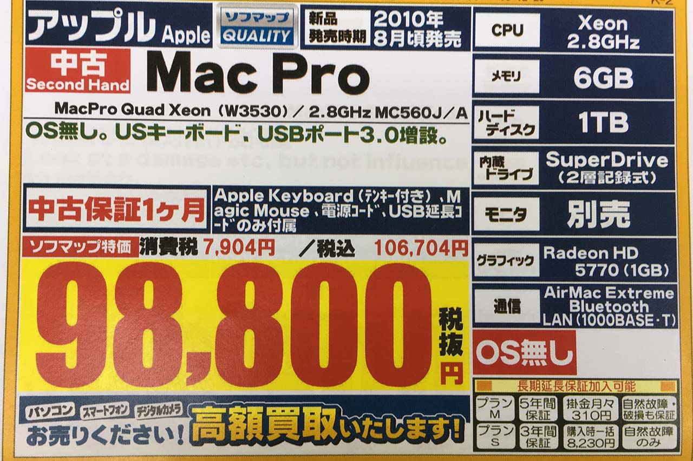
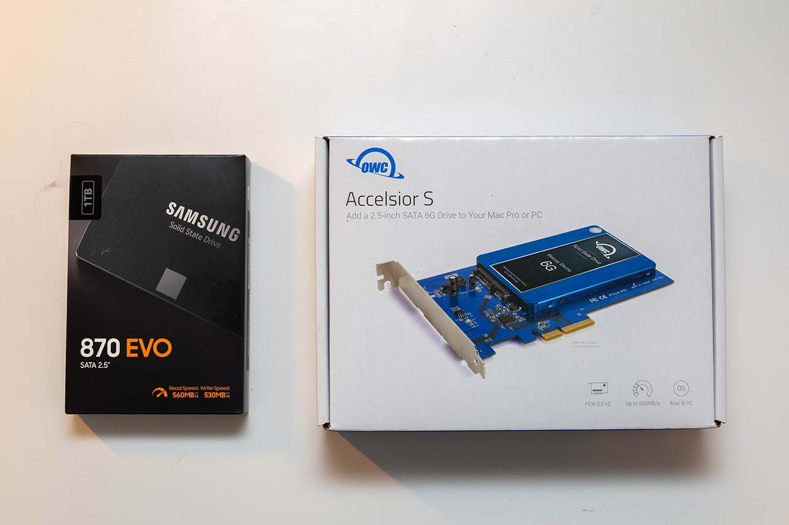
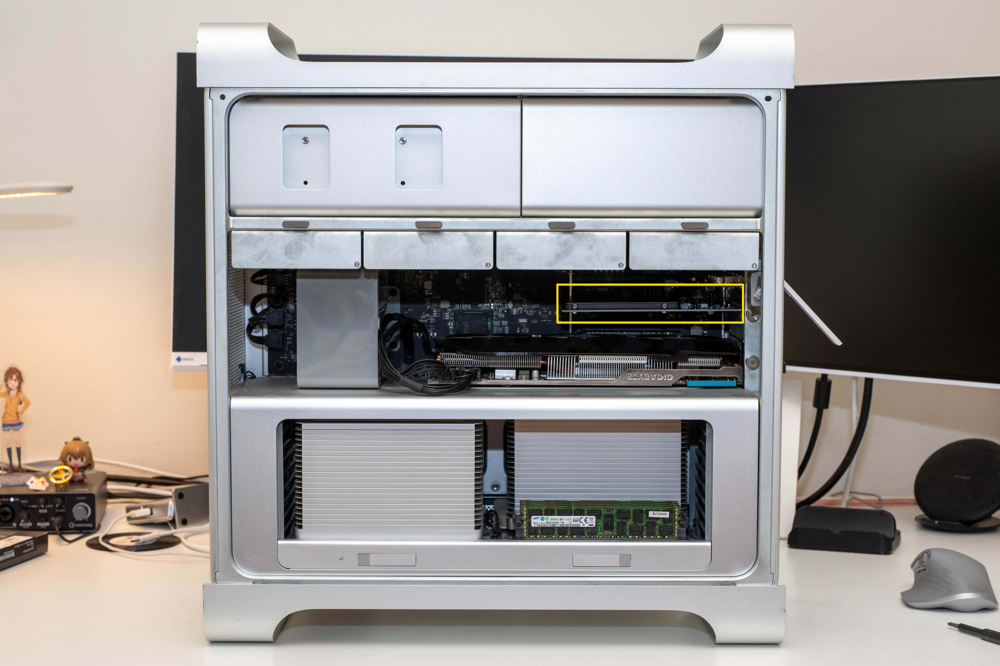

[Y づドン/テクノロジー合同 Advent Calendar 2021](https://adventar.org/calendars/6890) 17 日目の記事です。

私の担当分も残すところ 2 回となりました。今回は、私の相棒である Mac Pro Mid 2010 の最新の情報をお伝えするよ。

<!-- truncate -->

### Beauty on the outside.

かわいい。

美しさと機能性を両立した世紀の傑作であるところの Mac Pro Mid 2010 を購入したのは 2017 年 3 月のこと。

今は亡き Mac Collection（秋葉原）で、7 年間夢を見続けたコンピュータを買うことが遂に叶ったのである。

それから 4 年、私はちまちまとパーツ交換を続け、まだ途上ながらもなかなかのハイスペックマシンになったのです。

次章では、その内容を見ていきませう。

### Beast on the inside.

ここで購入時と現在の構成の比較を並べてみます。

| 項目           | 購入時               | 現在                     |
| :------------- | :------------------- | :----------------------- |
| `CPU`          | Intel Xeon W3530     | Intel Xeon E5320 × 2     |
| `RAM`          | DDR3-ECC 1066MHz 6GB | DDR3-ECC 1600MHz 64GB    |
|                |                      | (1066MHz 動作)           |
| `HDD/SSD`      | 1TB HDD              | 1TB SSD                  |
|                |                      | 1TB SSD                  |
|                |                      | 3TB HDD                  |
|                |                      | 2TB HDD                  |
| `GPU`          | ATI Radeon HD 5770   | ATI Radeon HD 7950       |
| `内蔵ドライブ` | SuperDrive           | SuperDrive               |
| `OS`           | なし                 | OS X v10.8 Mountain Lion |
|                |                      | macOS v10.14 Mojave      |

ほぼ全とっかえですが、特筆すべきはやはり<strong>卍 DUAL PROCESSOR 卍</strong>になったという点でしょう。

実はドーターボードだけ替えて、CPU はまだ強いやつにしていないので、CPU 性能自体は大したこと無いんですけどね。

### 最近の変更内容

スペック表だけ晒してイキるだけじゃあ格好がつかないので、最近行った作業内容を紹介します。

Mac Pro の M/B 上の SATA スロットの規格は SATA 2 で、SSD の性能が完全には引き出せません。

そこで、PCIe カードの SSD マウンタに起動ディスクを載せてやろうということで、やっちゃいました。

こいつらを用意して、

突っ込む。

これだけ。モジュール式ってすばらしい！

### 今後の展望

メモリもモリモリ、GPU も入るやつで最強、ストレージも満載、あとは CPU を強くするだけや。24 スレッドぶん回したい。
