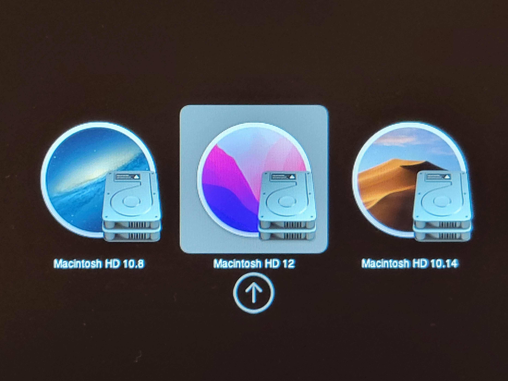

[年末の記事](/yt-advent2021-macpro/) の構成からさらに[CPU を換装](https://twitter.com/DE224_Cookie/status/1480437910138941440)し、名実ともに“最強”になった私の Mac Pro (Mid 2010)ですが、このマシンが対応している最新の OS である macOS Mojave では、多くのソフトウェアでアップデートを受けられなくなってきました。

Logic Pro や Adobe CC の最新バージョンが使えないのは流石に困るので、新しい Mac を買うことを検討し始めたのですが、昨今の最悪な為替レートと半導体不足のダブルパンチ、さらに現行 Mac のビミョーなラインナップなど、明らかに買いどきではないため、泣く泣く(?)Mac Pro (Mid 2010)の延命を決意、本来はサポート対象でない最新の macOS Monterey を無理やりインストールすることにしました。

<!-- truncate -->

### やったこと

上述のとおり、macOS Monterey は Mac Pro (Mid 2010)をサポートしていません。

そこで、[OpenCore-Legacy-Patcher](https://github.com/dortania/OpenCore-Legacy-Patcher)というソフトウェアを使用します。

また、以前から使っていた**OS X v10.8 と macOS v10.14 の環境も残しつつ**作業を進めていきます。

##### 工程はざっくり以下のとおりです。

1. USB メモリを用意する
1. [OpenCore-Legacy-Patcher のリリースページ](https://github.com/dortania/OpenCore-Legacy-Patcher/releases/)から GUI アプリを落としてくる
1. 同アプリを開き、画面の指示に従って macOS のインストールメディアを作成、OpenCore のブートローダも USB にインストール
1. USB からブートし、（今回は OS を共存させるため起動ディスクのパーティションをあれこれするなどしてから）macOS Monterey をインストール
1. 起動ディスクに OpenCore をインストール
1. macOS Monterey のムカつく表示や設定を少しマシにする

[公式にすげー整ったドキュメントがある](https://dortania.github.io/OpenCore-Legacy-Patcher/)ので、やってみたい人はこちらを参照されたし。

本来、Monterey（というか Mojave 以降）に対応していない Mac の多くは、**搭載されている GPU が Metal API に対応していない**ため、macOS のインストール後に OpenCore-Legacy-Patcher に含まれている GPU Acceleration Patch を当ててやる必要がありますが、この Mac には[年末の記事](/yt-advent2021-macpro/)でご紹介したとおり、Metal 対応の ATI Radeon HD 7950 が入っているので、その必要はありませんでした。

さて、次節からは作業内容をゆるく紹介していきます。

### OpenCore-Legacy-Patcher でインストールメディアを作成

まず OpenCore Legacy Patcher の GUI 版を落としてきます。

アプリを起動したら、“Create macOS Installer”を選択、画面の指示に従ってポチポチと進めていきます

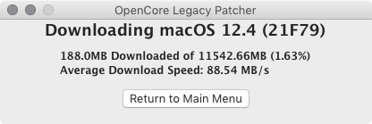
ダウンロード中。

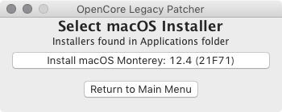
ダウンロードが終わったら、インストールメディアを作成する。

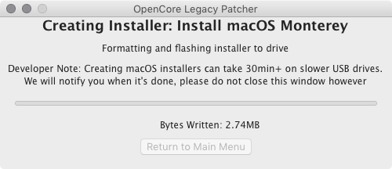
結構な容量をちまちま USB に書き込むので、それなりに時間がかかります。待つべし。

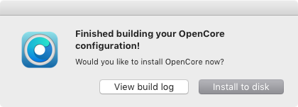
あとは、ブートローダをビルドしてインストールするだけ。これも勝手にやってくれるので楽ちん。

### インストールなど

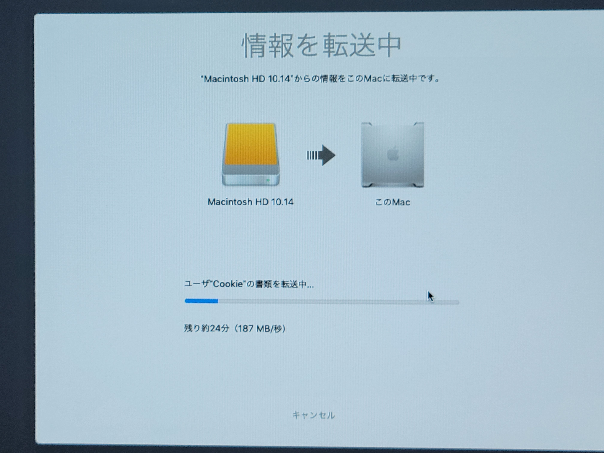
まず macOS Mojave の環境を別の起動ディスクに移します。これが一番時間取られる。

ここからが本番。スタートアップマネージャから、先程作成したインストールメディアを選択すると、

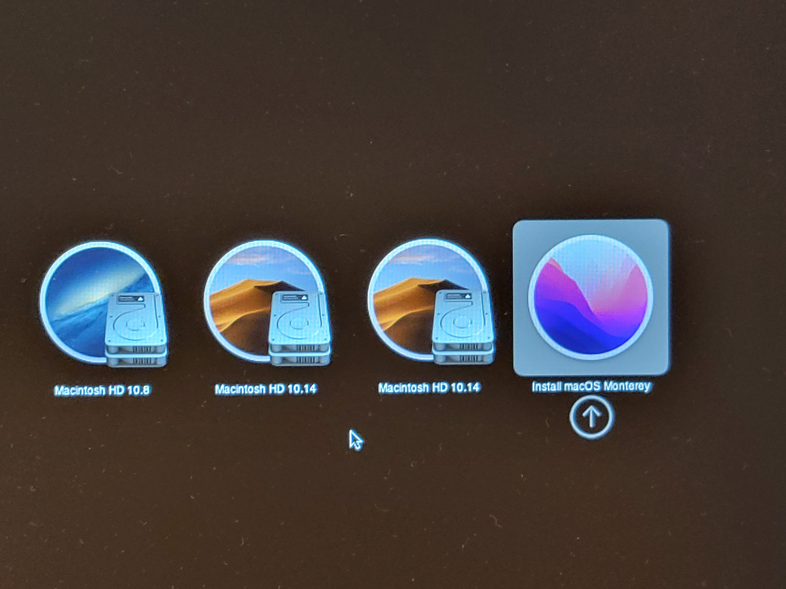
OpenCore の画面になるので、Monterey のインストーラを選択。

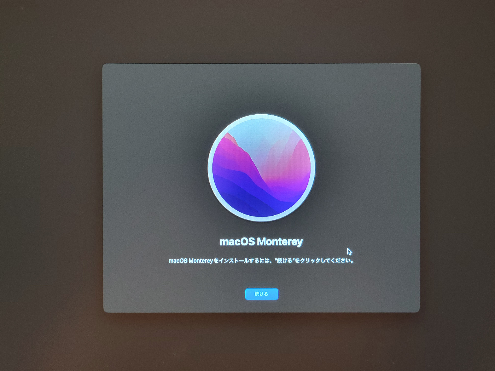

> 新しい場所 探すときがきたよ
> この先はいつもどおり、画面に従って初期設定をするだけですな。

**ドンッ！**

実は初回起動時、GPU アクセラレーションが正常に動作していなかったのですが（全体的に描画がモッサリし、透過やぼかしの処理ができていないなどの症状）、これは再起動で解決しました。

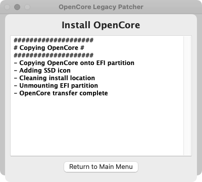
最後に、ブートローダを SSD にインストールします。

起動時は SSD にインストールした OpenCore ブートローダ経由で起動ディスクを選ぶ必要があります。スタートアップマネージャから直接 Monterey の起動ディスクを選んでも、駐禁マークが表示されるだけでブートできません。

### ムカつく UI をマシにする

いざインストールに成功してみると、やたらデカくて丸っこい UI デザインが鼻につきます。せっかく大きな画面サイズなのに、UI の各要素がタッチ操作できそうなほど大きいのは考えものです。

また、UI サイズ以外にも画面の隅々から何とも形容詞しがたい「気持ち悪さ」を感じていました。

UI サイズについては、Finder のサイドバーが何よりも気に入らなかったのでそこを変更しました。

そして、「気持ち悪さ」の大部分は半透明でブラーがかかった UI によることが判明したため、アクセシビリティ設定からそれも無効にしました。

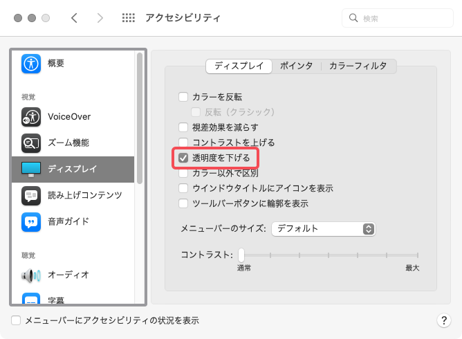

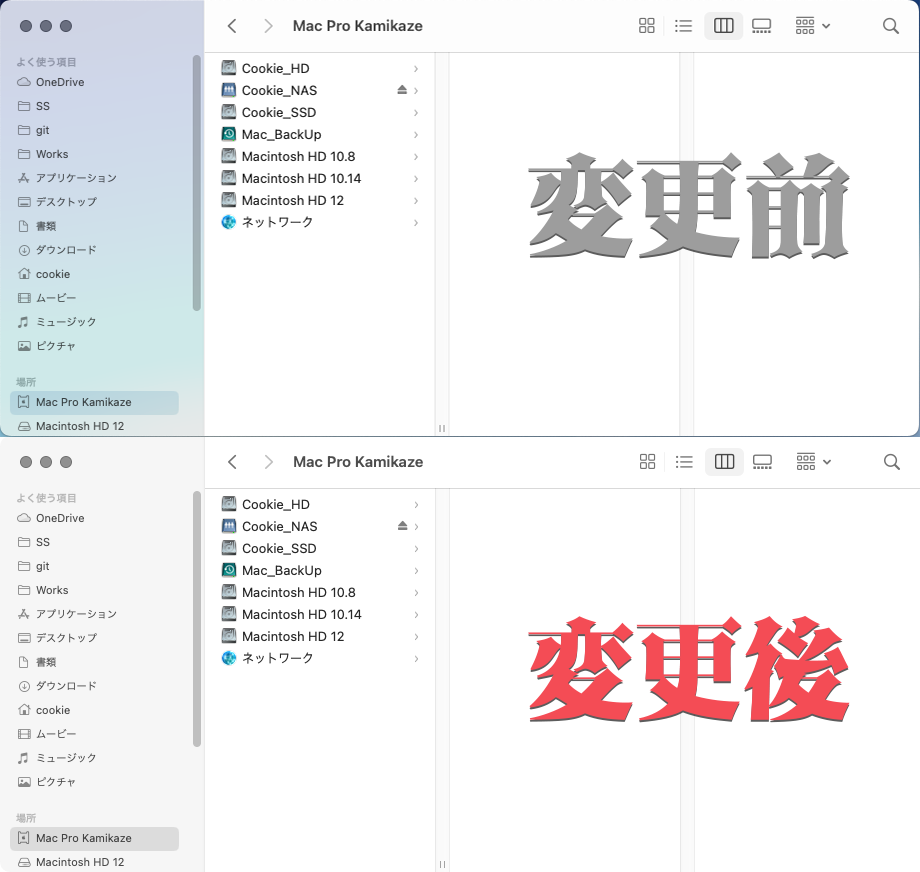

少しはマシになったかな。嫌いだけど。

### アップデートは普通に降りてくる

Monterey を入れたものの、ずっと Mountain Lion 環境での作業が続いていましたが、久しぶりに Monterey を起動したら macOS 12.5 のアップデートの案内が来ていました。
特別な操作をすることもなく、すんなりとアップデートすることができました。

### その他感想

UI こそ気に入りませんが、これといった不具合もなく安定して動いています。12 年前のマシンだとは思えないほどサクサク動くし、視覚体験以外は非常に快適です。

また記事を改めて書きますが、メインで使っている Windows マシンが故障したせいで、図らずも Monterey 環境をガンガン使うことになってしまいました。

本来の用途である DTM 以外にも大学レポート関連作業（地味にメモリを食いつぶす）に落書き、動画編集などなど、メインマシンが担っていた作業を当分の間 Mac Pro (Mid 2010)で行うことになります。

これからも使い倒していくぜ！
