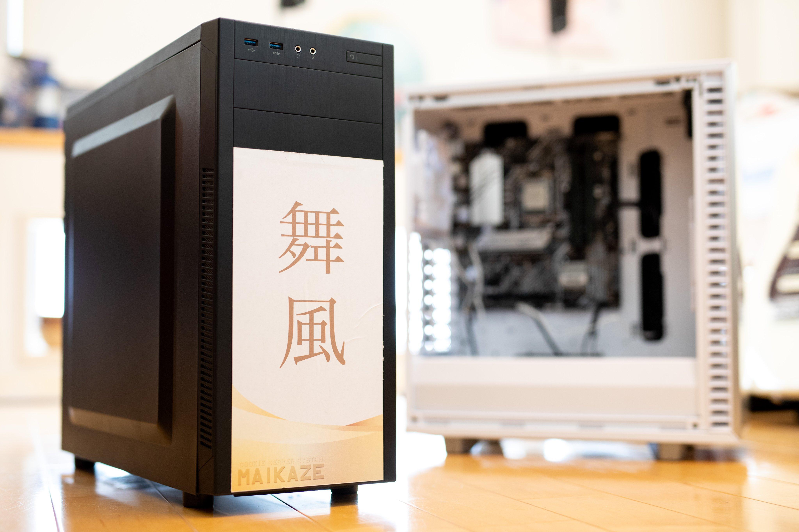

[Y づドン・Rintarnet 合同 Advent Calendar 2022](https://adventar.org/calendars/7442) 16 日目の記事です。

舞風サーバについては更新したタイミングで記事にするつもりでしたが、時間的余裕がなくてズルズルと年末まで来てしまったため、アドカレ記事でやります。

要旨としては、化石のような構成だった自宅サーバを更新しました。以上。まじでそんだけ。ブラウザバックどうぞ。

<!-- truncate -->

### 舞風サーバとは

舞風サーバってなんぞやという話ですが、このブログサイトなどをホストしている自宅サーバです。

設置したのは 2020 年で、ファイルサーバが欲しかったので NAS を買うつもりが、ウイルス禍による休校でウルトラ暇だったのでサーバマシンを組んでしまったのが始まりです。このあたりは[別の記事](https://mi.maikaze.moe/@Cookie/pages/yt-advent2021-maikaze-internet.html)でさらっと解説してあります。

こんな軽いノリで組んだので上で紹介した記事で書いた通り、ハードウェア構成も古く、ソフトウェアの選定も雑で、役割を増やすごとに限界を感じるようになってきました。

### とりあえず新旧構成の比較

そんなこんなで有言実行する形で遂に今年ハードウェア・ソフトウェアともに一新したわけですが、グダグダ理屈を並べるよりも比較表を置いてしまったほうが分かりやすいよねということで、ドン。

| 項目      | 購入時                | 現在                 |
| :-------- | :-------------------- | :------------------- |
| `M/B`     | ASRock X58 Extreme3   | ASUS PRIME B560-PLUS |
| `CPU`     | Intel Xeon W3690      | Intel Core i5-11400  |
| `RAM`     | 20GB 1066MHz DDR3-ECC | 32GB 2666MHz DDR4    |
| `HDD/SSD` | 128TB SSD             | 512GB SSD            |
|           | 6TB HDD               | 6TB HDD              |
|           |                       | 6TB HDD              |
| `GPU`     | なし                  | UHD Graphics 730     |
| `OS`      | CentOS 7              | Proxmox VE           |

一気に 10 年分ぐらい進化しました。

構成を見直すついでに CentOS をやめ、ナウでヤングでトレンディな PVE を採用したところもポイントです。

ゲスト OS も CentOS から Ubuntu に変えたため、ほぼイチから環境構築をやる感じになり、これまでテキトーだったネットワーク周りの設定もある程度最適化されました。

PVE にしたメリットとしては、要らないパッケージが少ない点と、Web の管理画面が（色々できそうで何もできないけど）結構便利な点が挙げられます。

### やりたいこと／やんなきゃいけないこと

オペミスでふっ飛ばしてしまった Minecraft サーバを復活させないといけない。3 ヶ月ぐらい放置してる。

動かすだけなら今すぐできるんだけど、バックアップとかのスクリプトが全部組み直しなのと、バックアップから復元した環境の動作検証が面倒くさくて……。

やってみたいこととして、LXC（Linux Containers）を使ってみたい。どうも仮想ディスクを置くのに必要なパーティションをぶっ壊してしまったみたいで、何をするにもまず PVE の環境を直さないといけない。面倒くさい……。

### まとめ

一歩進んで二歩下がった感の強い設備更新でしたが、ハード／ソフトともに化石であった状態から脱却し、今後色々やってみる下地を作ることはできました。

今年後半はアホ忙しかったので全然触れなかったし、来年も色々忙しそうだけど、自分のペースで遊んでいきたいと思います。
