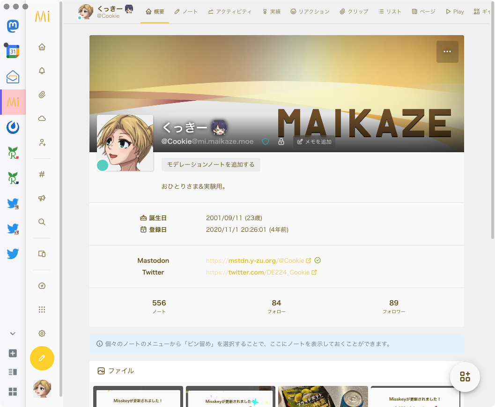

[Fediverse (2) Advent Calendar 2024](https://adventar.org/calendars/10064) 4 日目の記事です。

### こんにちは

[くっきー](https://cookie.kumano.moe/) と申します。

Fediverse では、主に [Y づドン！](https://mstdn.y-zu.org/@Cookie) と [自分の Misskey サーバ](https://mi.maikaze.moe/@Cookie) で活動しています。

お題も決めずに応募してしまったので、何を書こうか考えあぐねていましたが、今年ちょうど社会人になってしまったので、環境の変化とそれに伴う SNS との距離感の変化についてポエムってみようと思います。

<!-- truncate -->

### そもそも SNS やってないよね

よくよく考えたら、自分が一番 Fediverse で騒がしく過ごしていたのは Google+がなくなった 2019 年〜クローズドコミュニティに引き込もるようなった 2021 年頃までのごく短い期間でした。

とはいえ月に数回しか発言しない [Twitter](https://twitter.com/DE224_Cookie) に比べれば、日に数回〜数日に 1 回は発言している Fediverse は、現在の SNS 活動における主軸といって問題ないでしょう。

しかし、Fediverse への依存度が下がるにつれフォロー・フォロワーを増やすでもなく、比較的交流のあった方も引っ越したり活動の場を移したりで関わるユーザが減っていったなとは感じます。

一日中 PC に張り付いて何かしらの作業をしながらひとりごちだり、TL にいる誰かに絡んだり……という使い方をしなくなって久しいです。

### そうして社会人になった

平日に全く SNS ができない環境にいるわけではありませんが、 **正直平日の昼間に呟くことなんて「ねむい」と「かえりたい」ぐらいしかない。**

余暇も個人的な作業をするかクローズドコミュニティで喋るかの二択で、Fediverse のタイムラインを眺めるということをあまりしなくなりました。

クローズドコミュニティは似た属性の人がいるし、大っぴらに話せない話題も共有できるしで居心地が良いのですが、コミュニティの外側の意見や考え方がどうしても入ってきづらいです。

これは Fediverse のサーバにおいても似たような特徴はあると思いますが、Fediverse には連合という概念があるので、当然風通しは良いですよね。

### 一方で 5 年目に突入した自分の Misskey サーバ

2020 年 11 月に遊びで建てた Misskey サーバですが、なんと 5 年目に突入しました。

友人数名を招待こそしたものの、ほぼ「おひとりさま」として細々と運営しています。

ユーザも抱えていないですし、カスタムも UI 程度しかイジっていないので、メンテナンスコスト自体はそこまで高くないのですが、数回の環境引越しを挟んでも特に事故なく続けられている点は胸を張っても良いかなと思います。

4 年やってて 500 程度しか投稿していないあたりから低浮上であることが透けて見えますが、今後はメインである Mastodon のアカウント伝いにフォローを増やして行きたいという気はあります。

### 雑なまとめ

だらだらと書いてきたように、自分の SNS への依存度はだいぶ下がってしまいましたが、今までやってきた SNS のなかで Fediverse がもっとも居心地の良い場所であることは変わっていません。

社会人になってから、外からの刺激を受けるということが今まで以上に疎かになりがちなので、Fediverse での活動も拡大していきたいという宣言をしておこうと思います。

ただ、フォローの増やし方もどんな投稿をすれば良いかも思い出せない……。テキトーでいいんだよね。

「やらなければいけない」というプレッシャーほど楽しくないものはないので、今後も自分のペースでゆるくやっていきます。
