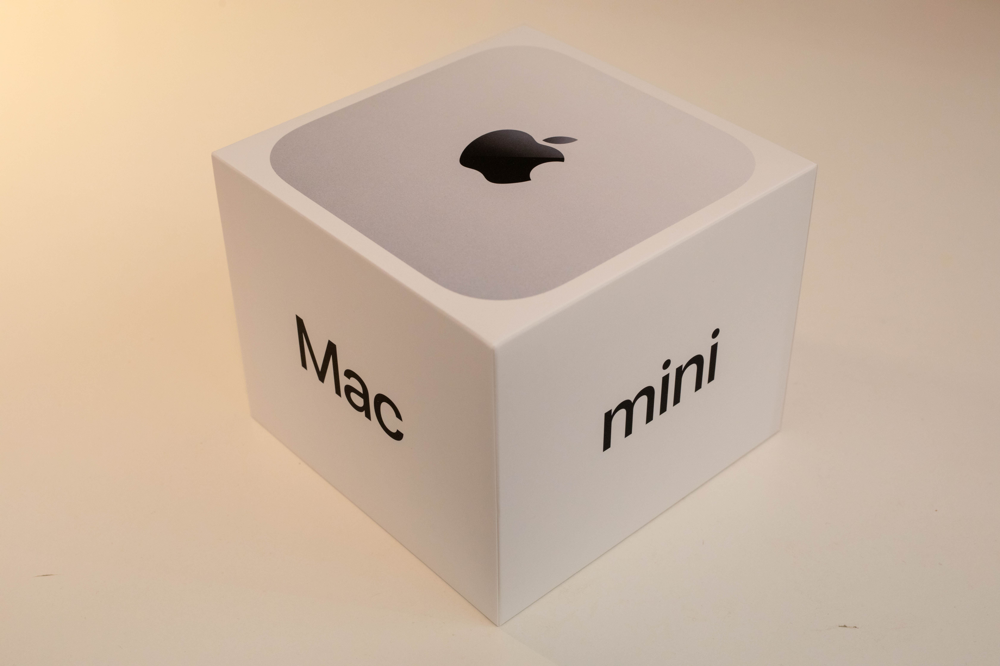
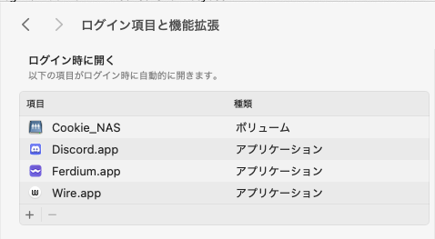
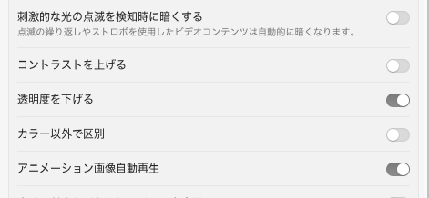
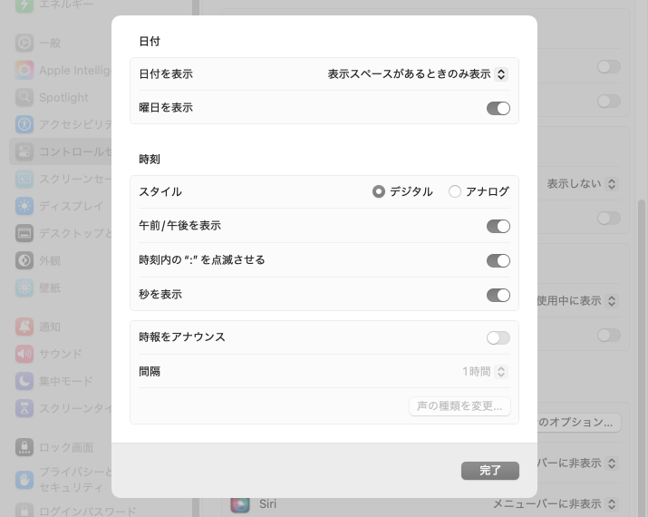
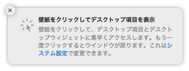
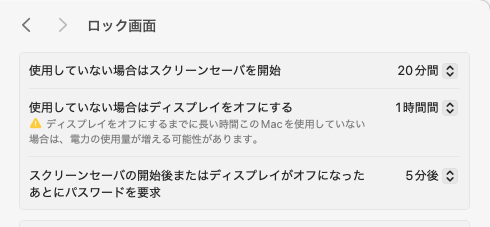
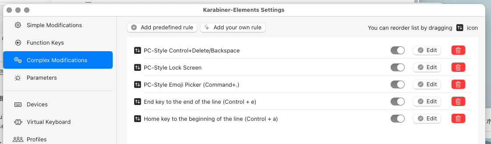

Apple アンチであるにも関わらず、 [新型 Mac mini を買ってしまいました](https://twitter.com/DE224_Cookie/status/1851286209273995643) 。M4 Pro ですよ。ひー。

iPhone SE (第 1 世代) 以来なので、新品の Apple 製品を買うのは実に 8 年ぶりです。

ハードもソフトもすっかり勝手が変わってしまい、かつての直感的な UI は見る影もなくなっていますが、大枚叩いて買った以上は活用しないと勿体ない。さっさと設定していきます。

<!-- truncate -->

## やったこと

主に次のようなことをやりました。

- UI や基本動作の「システム設定」での調整
- ホスト名の設定
- OnyX のインストール
- Karabiner-Elements によるキー動作のカスタマイズ
- Homebrew のインストール・シェルの設定
- 日本語入力（mozc）のビルド・インストール
- WSL2 環境への SSH

項目ごとにまとめていきます。

### UI まわり

システム環境設定がなくなってしんどい。どこのタブに何の項目があるかわからない。

#### まずフォントレンダリング

「使用可能な場合は滑らかな文字を使用」オプションが消えている。

Retina ディスプレイにあらずんば Mac ユーザにあらずということなのだろうが、Apple アンチの私には関係のないこと。

```shell
$ defaults -currentHost write -g AppleFontSmoothing -int 0
```

これでアンチエイリアスを切った。

#### 一般

重要な設定がここに入りこんでいる。Apple に限った話ではないけど、「一般」とか「その他」とか「便利な機能」とかに例外的な項目を押し込むのは良い設計ではないよね……。

##### ログイン項目と機能拡張



かつては「ユーザとグループ」にあったログイン時に自動で開くアプリの設定はここ。

#### アクセシビリティ



半透明の UI 要素が視認性を大きく損ねているので、アクセシビリティの「ディスプレイ」から「透明度を下げる」を有効に。

#### コントロールセンター

メニューバーに表示されるアイコンなどはここで設定できる。ほとんどいらないので非表示設定に。



「時計のオプション」から、メニューバーの時計に秒数まで表示させるように。

#### デスクトップと Dock

##### Dock

ここの設定項目は昔から変わらない。好きなように

##### デスクトップとステージマネージャ



これが曲者だった。デフォルトでは、デスクトップをクリックすると全てのウィンドウが捌けてしまう。


大変不愉快なので、 **「壁紙をクリックしてデスクトップを表示」を「ステージマネージャ使用時のみ」に変更** する。

その他の設定もよしなに変更する。

##### 外観

ここも昔から変わらない。自分は強調表示色を「グラファイト」に変更する。

##### ロック画面



昔は「省エネルギー」にあったディスプレイのタイムアウト等に関する設定はここにある。

ダメダメ翻訳かわいい。

### ホスト名の設定

厳密には macOS のお名前は 3 種類あるが、GUI からちまちまいじるよりは `scutil` コマンドで設定してしまうのが楽そう。

```shell
$ scutil --set ComputerName Taiho
$ scutil --set LocalHostName Taiho
$ scutil --set HostName Taiho
```

### OnyX を入れる

[これがないと始まらない](https://titanium-software.fr/en/onyx.html) 。

### Karabiner-Elements を入れる

Home や End キーの挙動が Windows と違うのが気に入らない。なんとかします。

まず [Karabiner-Elements](https://karabiner-elements.pqrs.org) をダウンロード・インストール。

起動したらキーボードレイアウトを教えてあげて、諸々の権限をつける。

Complex Modifications タブから「Add predefined rule」を選択し、「Import more rules form the Internet (Open a web browse)」をクリック。

ブラウザが開くので、「PC-Style Shortcuts」を探してインポート。



インポートされたショートカットの中から、「Home key to the beinning of the line (Control + a)」、「End key to the end of the line (Control + e)」を有効にする。

### Homebrew を入れる

[brew.sh](https://brew.sh) の言うとおりにインストール。

#### ついでに fish を入れる

人間に優しいシェルを入れよう。

```shell
$ brew install fish
```

`/etc/shells` に `/opt/homebrew/bin/fish` を追記した上で、デフォルトのシェルを変更

```shell
$ chsh -s /opt/homebrew/bin/fish
```

homebrew のパスを通す。

```shell
> fish_add_path eval /opt/homebrew/bin
```

### mozc を入れる

Google 日本語入力を入れようとしたら、amd64 だった。さすがに常駐するアプリがそれは……というわけで。

[りぃどみぃ](https://github.com/google/mozc/blob/master/docs/build_mozc_in_osx.md#software-requirements) の言うとおり、XCode や Bazel、CMake を入れた上でビルドしてインストール。

自分は fish を使っているので、venv をアクティベートするところでは `venv/bin/activate.fish` した

### Windows の WSL2 環境に SSH できるように

WSL2 の開発環境を使いたいので、VSCode から SSH できるように設定する。

#### ファイアウォールとポートプロキシの設定 （Windows）

PowerShell を管理者権限で開く。

```shell
> netsh advfirewall firewall add rule name="WSL2" dir=in action=allow protocol=TCP localport=22
```

22 番が開いた。

```shell
> netsh interface portproxy add v4tov4 listenport=22 connectaddress=[WSL2のIP] connectport=22
```

これで 22 番へのアクセスが WSL2 へ転送される。

WSL2 のネットワーク設定をミラーにする場合は、ポート転送の設定は不要。

### SSH の設定 (WSL2)

`/etc/wsl.conf`が以下のようになっているか確認

```conf
[boot]
systemd = true
```

ssh をインストールして起動して有効化

```shell
$ sudo apt install openssh-server
$ sudo systemctl start sshd
$ sudo systemctl enable sshd
```

公開鍵の登録をしたければする。

必要に応じて macOS 側で ssh の conf を書いてやるなどして、終了。
